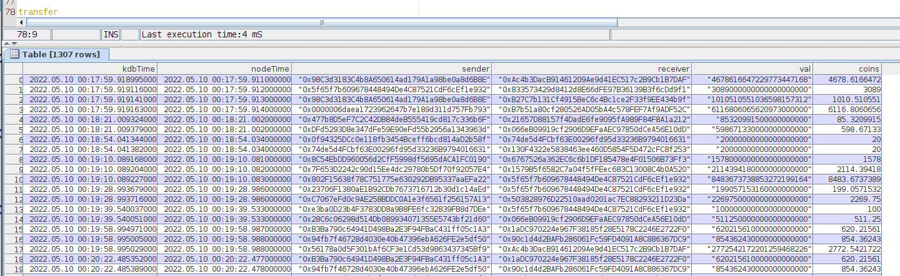

<h1>Capture transfer events in Apecoin to kdb using kafka</h1>

This code can be used to capture events from any ethereum contract into kdb. I've used Apecoin transfer events as an example.

Apecoin is a token on the ethereum blockchain. Tokens exist as smart contracts on the blockchain and have callable functions. Typically when the transfer function is called to send tokens from one address to another, a Transfer event is emmitted. 

More on apecoin here - https://apecoin.com/
The contract can be viewed here -
https://etherscan.io/address/0x4d224452801aced8b2f0aebe155379bb5d594381

This code subscribes to these events from the contract via a nodejs client which then publishes the event to kafka. A kdb process subscribes to kafka and stores the events as a table. The set up is probably the most complicated part of this - the code is simple since its just a proof of concept.

The end result looks like this

<h3>1. Setting up Zookeeper and Kafka</h3>

Download and install zookeeper from here:
https://zookeeper.apache.org/releases.html

Download and install kafka from here

